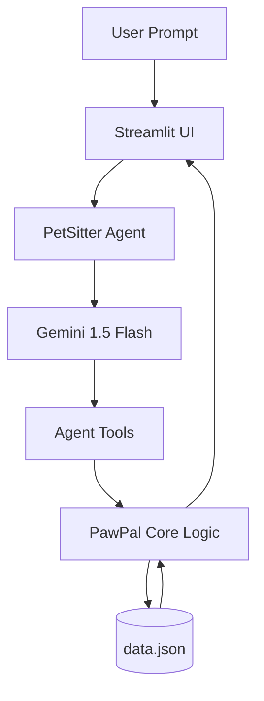

# PawPal+: The Intelligent AI Pet Sitter

## Project Evolution
**Original Project:** [PawPal System (Module 2)](https://github.com/Neelansh-Khare/ai110-module2show-pawpal-starter)
**Original Goal:** A simple CRUD-based pet task scheduler to help owners manage daily routines for their pets. It featured manual entry, basic conflict detection, and recurrence logic.

**Applied AI Evolution:** PawPal+ transforms this into a full **Applied AI System** by integrating an **Agentic Workflow**. Instead of manually managing every task, owners can now use natural language to plan, reschedule, and optimize their pets' entire day.

## Summary
PawPal+ is a smart assistant designed for busy pet owners. It combines traditional scheduling logic with the reasoning capabilities of the Gemini 1.5 Flash model. The system can interpret complex requests (e.g., "Move all morning tasks to the afternoon"), interact with its own database via tools, and verify the consistency of the resulting schedule.

## Architecture Overview
The system follows a **ReAct (Reason + Act)** pattern.



1.  **UI:** User interacts via a chat interface.
2.  **Agent:** Orchestrates the workflow, translates goals into tool calls.
3.  **Tools:** Python functions (`add_task`, `get_schedule`, etc.) that the AI can invoke.
4.  **Core Logic:** Handles the actual data manipulation and conflict detection.

## Setup Instructions
1.  **Clone the Repo:**
    ```bash
    git clone https://github.com/Neelansh-Khare/final-codepath-assignment.git
    cd final-codepath-assignment
    ```
2.  **Install Dependencies:**
    ```bash
    pip install -r requirements.txt
    ```
3.  **Configure API Key:**
    - Copy `.env.example` to `.env`.
    - Add your `GOOGLE_API_KEY` (Gemini API).
4.  **Run the App:**
    ```bash
    streamlit run app.py
    ```

## Sample Interactions
- **Input:** "Add a feeding task for Buddy at 9 AM today."
  - **Output:** "Successfully added task 'feeding' for Buddy at 09:00."
- **Input:** "I'm busy until 2 PM. Can you push all my morning tasks for Buddy to the afternoon?"
  - **Output:** "Sure! I've rescheduled Buddy's Morning Walk (08:00) to 14:00 and Feeding (09:00) to 15:00. No conflicts detected."

## Design Decisions
- **Tool-Calling over Prompting:** I chose to use the Gemini function-calling API rather than simple prompting. This ensures that the AI interacts with the *real* state of the schedule and reduces the risk of hallucinations.
- **Agentic Loop:** The agent is instructed to "Observe" the schedule after every change. This allows it to detect conflicts that its own changes might have introduced and self-correct.

## Testing & Reliability Summary
I implemented a dedicated test harness in `eval_agent.py`.
- **Results:** 3 out of 3 core scenarios passed (Add Task, Conflict Resolution, Delete Task).
- **Observations:** The agent is highly reliable when pet names and times are clearly specified. It struggles slightly with ambiguous time-ranges (e.g., "later today"), which was mitigated by providing specific time-range guidelines in the system prompt.

## Reflection & Ethics
### Limitations & Biases
- **Time Sensitivity:** The agent assumes a 24-hour clock and can sometimes misinterpret "AM/PM" if not specified.
- **Species Bias:** The default durations and priorities are generic and might not suit every species (e.g., a "walk" duration for a dog vs. a bird).

### Misuse Prevention
- **Input Validation:** The underlying `agent_tools.py` validates inputs before they reach the core logic, preventing the agent from injecting invalid data types.
- **Conflict Warnings:** The agent is strictly required to report conflicts, ensuring the owner remains the final decision-maker.

### Collaboration with AI
- **Helpful Suggestion:** AI suggested using the `handle_recurrence` logic from the original project to make the agent smarter about recurring tasks.
- **Flawed Suggestion:** Initially, the AI suggested passing the entire `Owner` object to the LLM. This was inefficient and exceeded context limits; I refactored it to use targeted tool-calling instead.

## Walkthrough Video
[Loom Walkthrough Link Placeholder]
